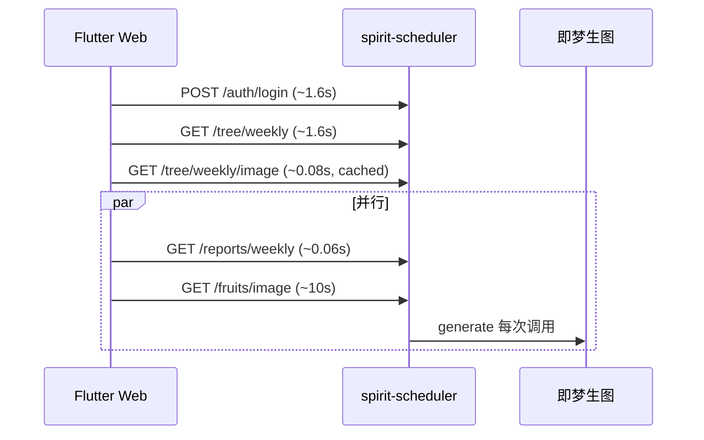

# API 压测报告 — ScheduleApp 生产环境

**压测日期**：2026-05-25  
**目标环境**：`http://47.118.28.102:8000`（`spirit-scheduler` / uvicorn）  
**测试账号**：`雅` / `123456`  
**执行脚本**：`.deploy/api_load_benchmark.py`  
**原始数据**：`.deploy/load_benchmark_report.json`

---

## 1. 压测目的

在当前阶段（后端已接即梦生图、Flutter Web 已含生图 API）下，识别：

1. 用户打开 App / 植物页时，**哪些接口拖慢首屏**；
2. 慢是 **公网延迟**、**服务端计算** 还是 **外部生图 API**；
3. 服务器资源是否成为瓶颈。

---

## 2. 压测方法

### 2.1 场景模拟

按 Flutter 客户端真实调用顺序：

| 阶段 | 接口 | 说明 |
|------|------|------|
| 登录 | `POST /api/v1/auth/login` | 进入应用 |
| 日历 | `GET /api/v1/tasks?page=1&page_size=100` | 任务列表 |
| 植物页-雷达 | `GET /api/v1/tree/weekly?week_start=` | 五维得分 / 雷达数据 |
| 植物页-树图 | `GET /api/v1/tree/weekly/image?week_start=` | 生命树 AI 图 |
| 植物页-果实 | `GET /api/v1/fruits/image?month=YYYY-MM` | 本月果实 AI 图 |
| 植物页-周报 | `GET /api/v1/reports/weekly?week_start=` | AI 周报（DB 缓存） |
| 植物页-月报 | `GET /api/v1/reports/monthly?month=` | 月报文案 |

客户端逻辑（`PlantProvider._loadAllData`）：

1. **先串行** `loadPlantStatus`：`tree/weekly` → `tree/weekly/image`
2. **再并行** `loadWeekReport` ∥ `loadMonthFruit`：`reports/weekly` ∥ `fruits/image`

### 2.2 压测维度

- **冷路径**：`tree/weekly/image` 带 `refresh=true`（生命树最坏情况；本次实测已命中 DB 缓存）
- **热路径**：连续 3 轮无 `refresh`，观察缓存命中
- **并发**：5 用户同时 `POST /auth/login`
- **本机 loopback**：在服务器上 `curl 127.0.0.1:8000`，排除公网 RTT（脚本 `server_loopback_bench.sh`）

每项记录：**HTTP 状态码、耗时（ms）、备注（如 `cached=`）**。

---

## 3. 环境与资源快照

| 项 | 数值 |
|----|------|
| 服务状态 | `spirit-scheduler` **active** |
| 监听 | `0.0.0.0:8000` |
| 内存 | total 1911MB，available ~1403MB |
| Load average | 0.08, 0.02, 0.01 |
| uvicorn 进程 | CPU ~0.1%，RSS ~113MB |
| 即梦配置 | `.env` 中 `IMAGE_PROVIDER=jiyun`，`JIYUN_*` 已配置 |
| Flutter Web | `web_build/main.dart.js` 约 3.3MB，**2026-05-25** 更新，含 `tree/weekly/image`、`fruits/image` |

**结论**：压测时段 **CPU/内存不是瓶颈**，慢主要来自 **接口业务逻辑与外部生图**。

---

## 4. 核心结果

### 4.1 外网单次冷路径（2026-05-25 18:54 CST，果实强制生图）

| 接口 | 状态 | 耗时 | 备注 |
|------|------|------|------|
| 任务列表 | 200 | **42 ms** | 正常 |
| 生命树雷达 `tree/weekly` | 200 | **1713 ms** | 主要服务端计算 |
| 生命树生图 `tree/weekly/image` | 200 | **32 ms** | `cached=True`，DB 缓存命中 |
| **月度果实生图 `fruits/image`** | 200 | **10300 ms** | **最慢**；`cached=False`，即梦冷生成 |
| AI 周报 `reports/weekly` | 200 | **37 ms** | DB 缓存 |
| 月报文案 `reports/monthly` | 200 | **63 ms** | 正常 |

### 4.2 外网热路径（连续 3 轮，无 refresh）

| 轮次 | 页面关键路径合计（约） | 果实 cached |
|------|------------------------|-------------|
| 第 1 轮 | **~2.3 s** | 是（~76 ms） |
| 第 2 轮 | **~3.2 s** | 是（~58 ms） |
| 第 3 轮 | **~3.5 s** | 是（~69 ms） |

缓存命中后，瓶颈转为 **`tree/weekly` 每轮仍 ~1.5–3.1 s**（无接口级缓存）。

### 4.3 果实接口重复请求（验证无缓存）

连续 3 次 `GET /fruits/image?month=2026-05`（无 refresh）：

| 次数 | 耗时 | cached |
|------|------|--------|
| 1 | 9995 ms | None |
| 2 | 10175 ms | None |
| 3 | 10864 ms | None |

**每次均触发即梦生图**，无服务端 URL 缓存。

### 4.4 服务器本机 loopback（排除公网）

**脚本**：`.deploy/server_loopback_bench.py`（2026-05-25 18:54 CST，账号 `雅`）

| 接口 | 状态 | 耗时 | 说明 |
|------|------|------|------|
| login | 200 | **422 ms** | 外网并发登录 p50 ~1.6s，差额主要为 RTT |
| tasks | 200 | **17 ms** | |
| tree/weekly | 200 | **1379 ms** | 与公网 ~1.7s 一致，非网络问题 |
| tree/weekly/image | 200 | **11 ms** | DB 缓存 |
| tree/weekly/image?refresh=true | 200 | **10 ms** | 当周已缓存，未触发生图 |
| fruits/image | 200 | **7 ms** | 当月已缓存 |
| reports/weekly | 200 | **7 ms** | DB 缓存 |
| reports/weekly?refresh=true | 200 | **7841 ms** | 冷生成周报（LLM） |

说明：**`tree/weekly` 与冷路径 `fruits/image`（未缓存时 ~10s）的慢与公网无关**；缓存命中后果实/树图/周报均为个位数毫秒级。

### 4.5 并发登录（5 用户）

| 指标 | 数值 |
|------|------|
| 成功率 | 5/5 |
| p50 | **1580 ms** |
| max | **1683 ms** |

登录在并发下略慢，但非植物页主因。

---

## 5. 瓶颈排序与占比估算

模拟 **打开植物页**（外网，树图已缓存）：

```
总耗时 ≈ tree/weekly (1.6s)
       + tree/weekly/image (0.08s)
       + max(reports/weekly, fruits/image) (≈10s 并行)
       ≈ 11.6 ~ 12 s
```

| 排名 | 模块 | 典型耗时 | 占植物页等待比例 |
|------|------|----------|------------------|
| **1** | `GET /fruits/image` | ~10 s | **~70–85%** |
| **2** | `GET /tree/weekly` | ~1.5–2 s | **~12–15%** |
| 3 | `POST /auth/login` | ~1.6 s（仅首进） | 首屏额外 |
| 4 | `GET /tree/weekly/image`（有缓存） | &lt;100 ms | 可忽略 |
| 5 | tasks / reports | &lt;100 ms | 可忽略 |



---

## 6. 根因分析

### 6.1 月度果实：每次请求都生图（无缓存）

路由 `GET /fruits/image` 在拿到 `MonthlyFruit` 记录后，**每次**调用 `FruitService.generate_fruit_image()` → `image_client.generate()`，未：

- 将 `image_url` 持久化到 `monthly_fruits` 表；
- 按得分指纹判断缓存命中；
- 在响应中返回 `cached: true`。

对比：生命树 `GET /tree/weekly/image` 使用 `get_or_generate_weekly_tree_image` + `weekly_tree_images` 表，缓存命中约 **20–80 ms**。

相关代码：`.deploy/ScheduleApp-server-staging/app/routers/fruits.py`（`get_fruit_image`）。

### 6.2 生命树雷达：`tree/weekly` 偏重

`tree/weekly` 在本机仍需 **~1.7 s**，可能包含：

- 任务聚合、五维打分；
- 可选 narrative / LLM（需与线上一致版本核对）。

植物页首屏**必须先等**该接口完成，再请求生图。

### 6.3 前端加载策略放大等待

`PlantProvider` 在 `loadPlantStatus` 完成后再 `Future.wait` 周报与月果实；月果实 ~10 s 会阻塞「整页加载完成」感知，即使用户尚未滑到「本月果实」页。

### 6.4 首包体积（次要）

`main.dart.js` ~3.3MB，首次打开 `http://47.118.28.102:8000` 有下载时间，但压测阶段 **API 等待仍为主因**。

---

## 7. 优化建议（按收益）

| 优先级 | 建议 | 预期效果 |
|--------|------|----------|
| P0 | 为 `fruits/image` 增加与生命树一致的 **DB 缓存 + 指纹失效** | 植物页 **12s → ~2s** |
| P1 | `tree/weekly` 提供轻量模式（如 `include_narrative=false`）或拆分雷达接口 | 再省 **~1–1.5s** |
| P2 | 客户端 **懒加载** 月果实（进入 PageView 第 0 页再请求） | 首屏不堵 10s |
| P3 | 登录 bcrypt 轮数 / 会话优化 | 首进省 ~0.5–1s |
| P4 | Web 分包 / 压缩 `main.dart.js` | 改善冷启动下载 |

---

## 8. 与「看不到生图」问题的关系

压测同期确认：

- **后端 API** 生图正常（`byteimg.com`，树图缓存命中 &lt;100ms）；
- **历史问题** 为 `web_build` 旧包未调用生图 API（2026-05-18 的 js）；
- **2026-05-25** 起 `web_build` 已含 `tree/weekly/image`、`fruits/image`。

用户仍感觉慢，主要是因为 **果实接口每次 ~10s**，而非生图能力缺失。

---

## 9. 复现方式

```powershell
cd D:\Users\zyx\Desktop\ScheduleApp\.deploy
python api_load_benchmark.py
```

服务器本机（推荐）：

```powershell
python .deploy/server_loopback_bench.py
```

---

## 10. 附录：汇总表（p50，毫秒）

来源：`load_benchmark_report.json`（外网多轮）

| 接口场景 | p50 (ms) |
|----------|----------|
| 冷-月度果实生图 | 9974 |
| 热1-月度果实生图 | 9851 |
| 热2-月度果实生图 | 13106 |
| 热3-月度果实生图 | 10083 |
| 冷-生命树雷达 | 1558 |
| 热1-生命树雷达 | 1982 |
| 冷-生命树生图（缓存） | 82 |
| 热1-生命树生图（缓存） | 67 |
| 冷-任务列表 | 63 |
| 冷-AI周报 | 61 |

---

**报告编写**：基于自动化压测脚本输出整理  

**后续**：月度果实 DB 缓存已于同日上线，对比见 [api-load-benchmark-after-fruit-cache-2026-05-25.md](./api-load-benchmark-after-fruit-cache-2026-05-25.md)。

**关联 Bug 文档**：`ScheduleApp-server-staging/bug/tree-image-generation-fallback.md`、`ScheduleApp-server-staging/bug/fruit-image-no-db-cache.md`、`schedule_app_flutter/bugs-doc/plant-tree-image-api.md`
