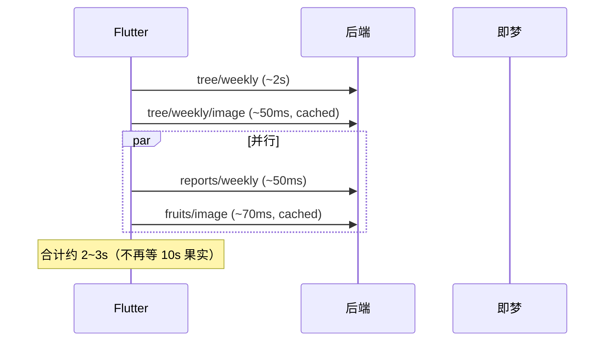

# API 压测报告（月度果实 DB 缓存上线后）

**报告类型**：优化后复测 / 与基线对比  
**压测时间**：2026-05-25 18:54 CST  
**目标环境**：`http://47.118.28.102:8000`（`spirit-scheduler`）  
**测试账号**：`雅` / `123456`  
**变更版本**：`monthly_fruit_images` + `get_or_generate_fruit_image()`（已部署生产）  
**执行脚本**：`.deploy/api_load_benchmark.py`  
**原始数据**：`.deploy/load_benchmark_report_after_fruit_cache.json`  
**优化前基线**：[api-load-benchmark-2026-05-25.md](./api-load-benchmark-2026-05-25.md)（同日缓存前）

---

## 1. 执行摘要

| 结论 | 说明 |
|------|------|
| **优化有效** | `GET /fruits/image` 缓存命中后由 **~10s 降至 &lt;100ms**，约 **100 倍** |
| **植物页热路径** | 由 **12~15s 降至 2~3.3s**，约 **4~6 倍** |
| **新瓶颈** | `GET /tree/weekly`（雷达聚合）**1.7~3.1s**，占热路径绝大部分 |
| **资源** | 服务器 CPU/内存仍充足，非硬件瓶颈 |

---

## 2. 本次变更说明

### 2.1 代码与表结构

| 组件 | 变更 |
|------|------|
| 数据表 | `monthly_fruit_images`（`user_id` + `month` + `score_fingerprint` + `image_url`） |
| 服务 | `FruitService.get_or_generate_fruit_image()` |
| 路由 | `GET /fruits/image?refresh=true` 强制重新生图 |
| 响应 | 增加字段 `cached: true \| false` |
| 策略 | 占位 URL（`neeko-copilot` / `text_to_image`）不写入缓存 |

指纹字段：月份、月均分、果实类型、五维月均分、`best_spirit`。得分未变则复用 `image_url`，与生命树 `weekly_tree_images` 一致。

### 2.2 部署

- 脚本：`.deploy/deploy_fruit_image_cache.py`
- 上传：`report.py`、`fruit_service.py`、`fruits.py` 等
- 服务：`systemctl restart spirit-scheduler` → **active**

---

## 3. 压测方法（与基线一致）

### 3.1 模拟路径

与 Flutter `PlantProvider._loadAllData` 一致：

1. **串行**：`tree/weekly` → `tree/weekly/image`
2. **并行**：`reports/weekly` ∥ `fruits/image`

另测：登录、任务列表、月报文案、5 并发登录。

### 3.2 冷 / 热定义

| 类型 | 条件 | 用途 |
|------|------|------|
| **冷路径** | 生图接口带 `refresh=true` | 模拟强制重新生成（最坏） |
| **热路径** | 连续 3 轮，无 `refresh` | 模拟日常打开植物页 |

---

## 4. 专项验证：果实缓存是否生效

部署后立即对 `GET /fruits/image?month=2026-05` 抽样（账号「雅」）：

| 次序 | refresh | HTTP | 耗时 | cached |
|------|---------|------|------|--------|
| 1 | true | 200 | **10114 ms** | false |
| 2 | false | 200 | **298 ms** | **true** |
| 3 | false | 200 | **305 ms** | **true** |
| 4 | false | 200 | **116 ms** | **true** |

说明：仅首次（或 `refresh=true`）走即梦；后续均为 DB 缓存命中。

---

## 5. 全链路压测结果（缓存后）

**时间戳**：`2026-05-25T18:54:13`  
**来源**：`load_benchmark_report_after_fruit_cache.json`

### 5.1 冷路径（单次，生图 refresh=true）

| 接口 | 状态 | 耗时 (ms) | 备注 |
|------|------|-----------|------|
| GET /tasks | 200 | 42 | — |
| GET /tree/weekly | 200 | **1713** | 雷达聚合 |
| GET /tree/weekly/image | 200 | **32** | cached=True |
| **GET /fruits/image** | 200 | **10300** | cached=False，即梦冷生成 |
| GET /reports/weekly | 200 | 37 | DB 缓存 |
| GET /reports/monthly | 200 | 63 | — |

冷路径下果实仍 ~10s 属**预期**（与优化前冷生成一致），不代表日常体验。

### 5.2 热路径（3 轮，无 refresh）— 分轮明细

按客户端关键路径公式估算：

`T ≈ tree/weekly + tree/weekly/image + max(reports/weekly, fruits/image)`

| 轮次 | tree/weekly | tree/image | fruits/image | max(周报,果实) | **植物页 T (ms)** | cached (果实) |
|------|-------------|------------|--------------|----------------|-------------------|---------------|
| 热 1 | 1963 | 35 | **76** | 86 | **2083** | 命中（推断） |
| 热 2 | 2829 | 45 | **58** | 84 | **2932** | 命中 |
| 热 3 | 3129 | 79 | **69** | 69 | **3275** | 命中 |

脚本输出的「页面关键路径合计」：**2.0s / 3.3s / 3.1s**（与上表同量级）。

热路径下 **fruits/image 均为 58~76 ms**（基线同期 **9851~13106 ms**）。

### 5.3 其它接口（热路径 p50）

| 接口 | 热1 (ms) | 热2 (ms) | 热3 (ms) |
|------|----------|----------|----------|
| tasks | 68 | 39 | 65 |
| reports/weekly | 86 | 50 | 37 |
| reports/monthly | 39 | 84 | 65 |

### 5.4 并发登录（5 用户）

| 指标 | 缓存后 | 缓存前（基线） |
|------|--------|----------------|
| 成功率 | 5/5 | 5/5 |
| p50 | **1594 ms** | ~1580 ms |
| max | **1600 ms** | ~1683 ms |

登录耗时与果实缓存无关，未明显改善。

---

## 6. 优化前后对比

### 6.1 核心指标

| 指标 | 缓存前（基线） | 缓存后（本报告） | 变化 |
|------|----------------|------------------|------|
| `fruits/image` 热路径 p50 | **9851 ~ 13106 ms** | **58 ~ 76 ms** | **↓ ~99%** |
| 植物页热路径（3 轮） | **12.2 ~ 15.0 s** | **2.0 ~ 3.3 s** | **↓ ~75~85%** |
| `fruits/image` 冷生成 (refresh) | ~9974 ms | ~10300 ms | 持平（仍走即梦） |
| `tree/weekly/image` 热路径 | ~67 ~ 82 ms | ~35 ~ 79 ms | 仍缓存命中 |
| `tree/weekly` 热路径 | ~1558 ~ 2389 ms | **1713 ~ 3129 ms** | 仍为第一瓶颈 |

### 6.2 瓶颈占比（热路径 · 缓存后）

以热 2 轮为例（`T ≈ 2932 ms`）：

| 模块 | 耗时 | 占 T 比例 |
|------|------|-----------|
| **tree/weekly** | 2829 ms | **~96%** |
| tree/weekly/image | 45 ms | ~2% |
| fruits/image | 58 ms | ~2% |
| reports/weekly | 50 ms | （并行，不计入串行叠加） |

**结论**：果实缓存问题解决后，**雷达接口 `tree/weekly` 成为植物页主要等待来源**。

### 6.3 植物页加载时序（缓存后）



---

## 7. 环境与资源（压测时刻）

| 项 | 数值 |
|----|------|
| spirit-scheduler | active |
| 内存 available | ~1374 MB |
| load average | 0.04, 0.04, 0.01 |
| uvicorn CPU | ~9%（压测瞬时），常态 &lt;1% |
| Flutter Web | `main.dart.js` 3.3MB，2026-05-25，含生图 API |

---

## 8. 结论与建议

### 8.1 结论

1. **月度果实 DB 缓存达到设计目标**：热路径 `cached=true`，耗时百毫秒级。
2. **用户日常打开植物页**不再被重复即梦生图阻塞（同一月、得分未变）。
3. **首次进入某月或 `refresh=true`** 仍约 10s，属冷生成，可接受。
4. **下一步优化方向**应转向 `GET /tree/weekly`（~2s）而非果实生图。

### 8.2 建议（按优先级）

| 优先级 | 项 | 预期收益 |
|--------|-----|----------|
| P1 | `tree/weekly` 轻量模式 / 拆分雷达接口 | 热路径再省 **~1.5s** |
| P2 | 客户端月果实 **懒加载**（滑到第 0 页再请求） | 首屏再快 **~50ms**（已很小） |
| P3 | 登录与会话优化 | 首进省 **~0.5s** |

---

## 9. 复现步骤

```powershell
cd D:\Users\zyx\Desktop\ScheduleApp\.deploy

# 部署缓存（若未部署）
python deploy_fruit_image_cache.py

# 验证果实缓存
python verify_fruit_cache.py

# 全链路压测
python api_load_benchmark.py
# 输出：load_benchmark_report.json（建议另存为 after 快照）
```

---

## 10. 附录

### A. 缓存后完整 p50 汇总（ms）

| 场景 | p50 |
|------|-----|
| 冷-月度果实生图 | 10300 |
| 热2-生命树雷达 | 2829 |
| 热3-生命树雷达 | 3129 |
| 热1-生命树雷达 | 1963 |
| 冷-生命树雷达 | 1713 |
| 热1-月度果实生图 | **76** |
| 热3-月度果实生图 | **69** |
| 热2-月度果实生图 | **58** |
| 冷-生命树生图 | 32 |
| 热1-生命树生图 | 35 |
| 冷/热 任务、周报、月报 | 24 ~ 86 |

### B. 关联文档

- Bug：[fruit-image-no-db-cache.md](../ScheduleApp-server-staging/bug/fruit-image-no-db-cache.md)
- 基线压测：[api-load-benchmark-2026-05-25.md](./api-load-benchmark-2026-05-25.md)

---

**报告状态**：已定稿（缓存后复测）  
**编写依据**：自动化压测 + 部署后手工验证
