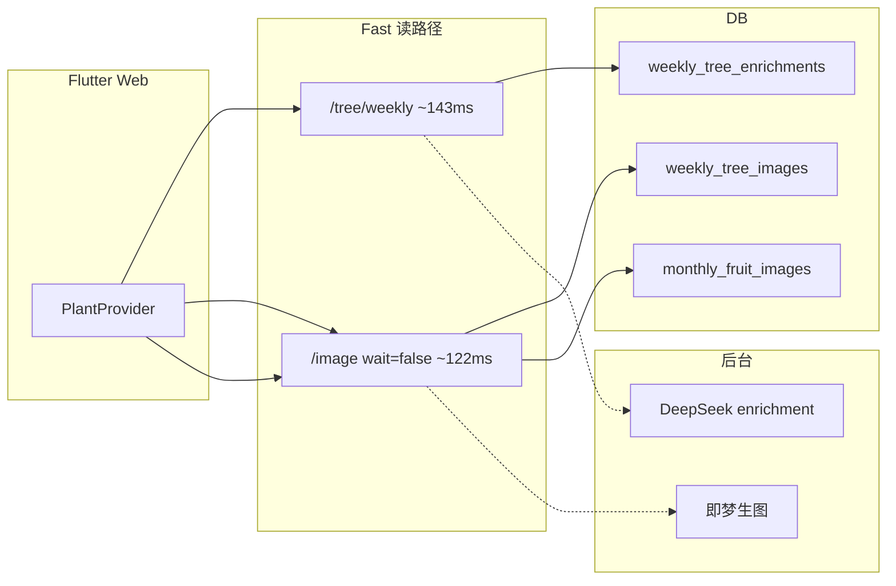

# 生图缓存机制综合 + 面试题库

---

## 简历写法（可直接用）

**生图与 AI 内容缓存体系（ScheduleApp）**

- 设计 **生命树周图 + 果实月图** 双表持久化缓存，以 **得分指纹** 失效，响应 **`cached`** 字段驱动前端零等待展示。
- 将 **同步 LLM / 同步即梦** 拆为：**Fast 读路径（&lt;200ms）** + **后台 enrichment / 异步生图** + **status 轮询**，植物页 API 由 **12–15s 降至 0.4s 级**（round2 压测）。
- 建立 **冷/热路径** 压测规范与三轮报告归档，支撑简历数据与线上回归。

---

## 架构一图（口述用）

---

## 缓存层次（必背）

| 层次 | 位置 | 粒度 | 失效 |
|------|------|------|------|
| 客户端内存 | `PlantWeekCache` 等 | 会话 | 退出/切周 |
| 结构化分数 | `SpiritWeeklyScore` | 周 | 重算分 |
| 生图 | `weekly_tree_images` / `monthly_fruit_images` | 周/月 | 得分指纹 |
| AI 文案 | `weekly_tree_enrichments` | 周 | 重跑 enrichment |

**重启 uvicorn 仍快** → 证明靠 **DB**，非进程内存。

---

## 我做了什么（综合清单）

1. 压测定位三层瓶颈（主题 01）  
2. 果实 DB 缓存对齐生命树（主题 02）  
3. `tree/weekly` Fast + enrichment 异步（主题 03）  
4. `wait=false` + status 轮询（主题 04）  
5. Flutter Web 全量部署 + wasm gzip + renderer auto（主题 05）  
6. refresh UPDATE 修 UNIQUE 500（主题 06）  
7. 报告归档 `benchmark-reports/`  

---

## 核心数据（面试直接背）

| 接口/场景 | 优化前 | 优化后 |
|-----------|--------|--------|
| 植物页 API（缓存命中） | 12–15s | **0.35–0.45s** |
| `tree/weekly` | 9.89s | **143ms** |
| `tree/weekly/image` 日常 | 10.03s | **122ms** |
| `fruits/image` 日常 | 16.58s | **133ms** |
| `fruits/image?refresh=true` | 500 | **200 ~10s** |
| loopback `tree/weekly` | ~1.7s | **12ms** |

来源：[round2](../benchmark-reports/api-load-benchmark-2026-05-25-round2.md)

---

## 面试要点（详细 · 综合题）

### Q1：用 3 分钟讲完整次优化？

**参考答案结构：**

1. **现象**：登录快、植物页慢；压测 12–15s。  
2. **定位**：非机器资源；`tree/weekly` 6 次 LLM；生图无缓存 10–17s；Web 首包大。  
3. **方案**：Fast API、DB 指纹缓存、异步生图+轮询、部署修复。  
4. **结果**：API 0.4s；refresh 修 500；生图仍 10s 仅强制刷新。  

---

### Q2：如果 QPS 涨 10 倍你怎么演进？

**答：**

- **读**：Redis 缓存热点 URL、CDN 静态图。  
- **写**：生图 **队列**（Celery）、限流、幂等 key。  
- **LLM**：合并 prompt、缓存 enrichment、降级规则文案。  
- **DB**：Postgres 主从、索引 `(user_id, year, month)`。  
- **观测**：p95、即梦错误率、pending 超时率。

---

### Q3：指纹缓存和 HTTP Cache-Control 区别？

**答：**

- **指纹**：业务「数据变了吗」→ 决定是否调即梦。  
- **HTTP 缓存**：浏览器/CDN 对 **同一 URL** 复用。  
- 我们 JSON 里 `cached` 是 **应用语义**；图片 URL 可再加 CDN immutable。

---

### Q4：为什么「列表偶发 6s」不优先修？

**答：**

- loopback **11ms** → 非 SQL 慢查询。  
- 外网噪声 vs 植物页 **确定性 10s** → ROI。  
- 若修：连接池、索引、分页、减少 N+1。

---

### Q5：线上如何回归这次优化？

**答：**

- 跑 `api_load_benchmark.py` 对比 JSON。  
- 看 `cached=true` 比例、`image_status` 从 pending→ready 耗时。  
- 抽查 `refresh=true` 无 500。  
- Flutter 部署后 curl Manifest 200。

---

### Q6：和 Sky-Chat 类项目的性能点有何不同？

**答（对比表）：**

| | Sky-Chat | ScheduleApp 本专项 |
|--|----------|-------------------|
| 热点 | SSE 流式、渲染 120→40 次/s | 外部 API、DB 缓存 |
| 协议 | 自定义 SSE + FSM | 轮询 status |
| 瓶颈 | setState 频率 | LLM/即梦同步 |
| 指标 | TBT、chunk KB | p50 接口秒级 |

可展示你 **多端性能经验**：前端渲染优化 + 后端 IO 优化都做过。

---

### Q7：面试官问「你还剩什么技术债？」

**诚实答：**

- 生图 **refresh 仍 ~10s**（第三方限制）。  
- 任务列表外网偶发抖动未深挖。  
- 单机 asyncio 后台任务，多实例要 **分布式锁/队列**。  
- CanvasKit 首包仍大，可 Skwasm / 拆包 / CDN。  

---

## 快速自测（每题 30 秒答）

1. 植物页为什么并行仍慢？ → **max(慢分支)**  
2. 二次打开快是内存吗？ → **DB**  
3. cached 字段含义？ → **未调即梦**  
4. 500 根因？ → **DELETE+INSERT UNIQUE**  
5. Fast 砍掉了什么？ → **同步 LLM**  
6. wait=false 得到什么？ → **pending + 占位/旧图**  

---

## 相关文件（源码索引）

- `fruit_service.py` / `tree_service.py`  
- `background_runner.py`  
- `api_plant_repository.dart`  
- `.deploy/api_load_benchmark.py`  
